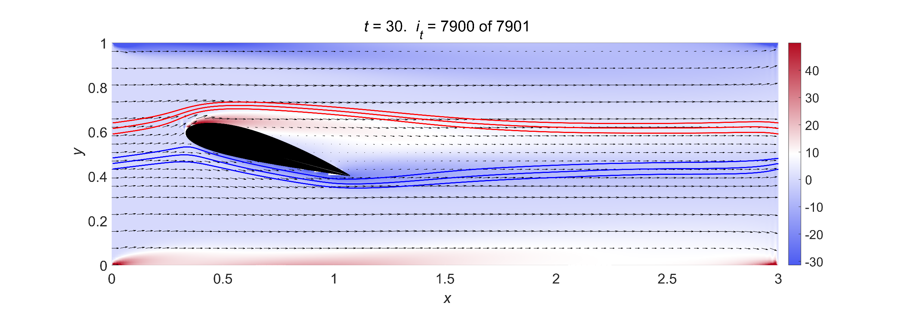

# Computational Fluid Dynamics Solver in MATLAB

These scripts implement finite-difference schemes for 2D incompressible Navier-Stokes equations to be used as a numerical solver. For detailed information see the technical Report.pdf.

## Scripts

The main script is FlowAroundCylinder.m, that discretizes a circular cylinder geometry to visualize its vortex shedding showing streaklines.

The other ones are utility routines:
- ThomFormulae.m: computes boundary conditions for the vorticity using Thom's formulae
- RK4.m: carries out the numerical integration implementing a fourth-order Runge Kutta method
- ZitaRHS.m: computes the right-hand side of the vorticity differential equation
- PathlinesRHS.m: computes the right-hand side of the pathline differential equation
- zita2psi.m: computes the stream function from the vorticity
- psi2uv.m: computes the velocity components using the stream function

In addition, using the isInsideNACA2418.m routine it's possible to write a script carrying out the same numerical simulation for a NACA2418 airfoil geometry. 
- isInsideNACA2418.m: determines whether or not a given position lies inside a NACA2418 airfoil

## Results

